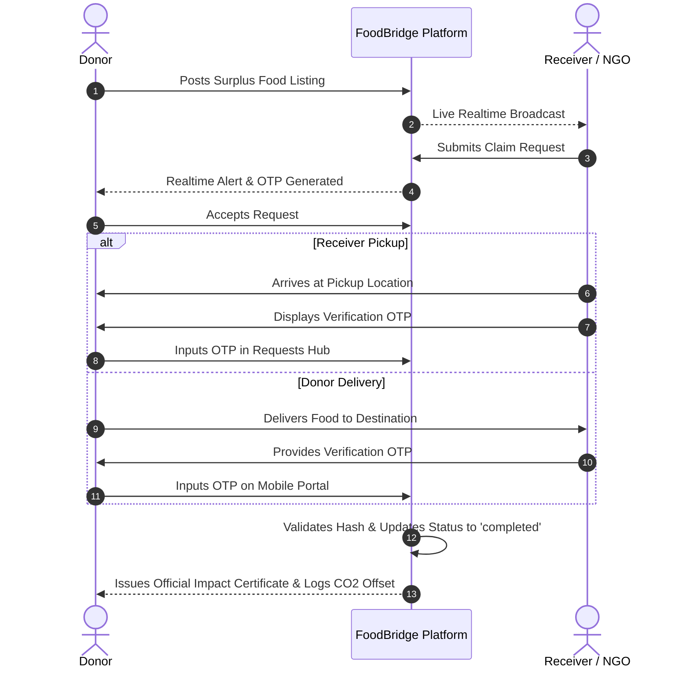
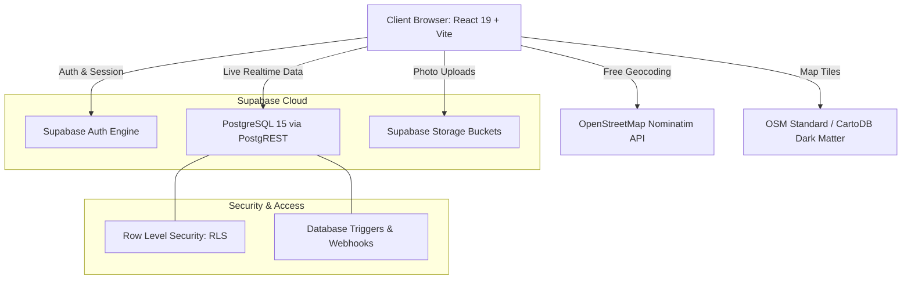

# FoodBridge 🍲🌱
### *Share Food. Share Hope.*

[](https://foodbridge-sandy.vercel.app)
[](https://react.dev/)
[](https://vitejs.dev/)
[](https://supabase.com/)
[](https://leafletjs.com/)
[](https://www.framer.com/motion/)
[](LICENSE)

---

## 📖 Table of Contents

- [About FoodBridge](#-about-foodbridge)
- [Mission & UN SDGs](#-mission--un-sdgs)
- [Core Features](#-core-features)
- [Role-Based Dashboards](#-role-based-dashboards)
- [Fulfillment & OTP Verification Protocol](#-fulfillment--otp-verification-protocol)
- [Geospatial Architecture & City Directory](#-geospatial-architecture--city-directory)
- [System Architecture](#-system-architecture)
- [Database Schema & Security (RLS)](#-database-schema--security-rls)
- [Tech Stack](#-tech-stack)
- [Project Structure](#-project-structure)
- [Getting Started & Local Development](#-getting-started--local-development)
- [Supabase Setup Guide](#-supabase-setup-guide)
- [Deployment (Vercel)](#-deployment-vercel)
- [Core Team](#-core-team)
- [License](#-license)

---

## 🌟 About FoodBridge

**FoodBridge** is a hyper-local, real-time food redistribution platform designed to bridge the gap between commercial food surplus (restaurants, catering halls, bakeries, corporate cafeterias, and residential communities) and hunger relief organizations (NGOs, soup kitchens, orphanages, and community shelters).

Every day, millions of tonnes of freshly prepared, high-quality food are discarded into landfills while vulnerable populations face acute food insecurity. FoodBridge provides the technological infrastructure to rescue this surplus in minutes through real-time notifications, interactive Leaflet maps, multi-step dual-OTP verification, and automated carbon offset calculations.

> 🔗 **Live Production URL:** [https://foodbridge-sandy.vercel.app](https://foodbridge-sandy.vercel.app)

---

## 🎯 Mission & UN SDGs

FoodBridge directly advances the United Nations Sustainable Development Goals:

- **SDG 2: Zero Hunger (Target 2.1 & 2.2)**: Ensuring equitable access to safe, nutritious, and sufficient food all year round for disadvantaged communities.
- **SDG 12: Responsible Consumption and Production (Target 12.3)**: Halving per-capita global food waste at retail and consumer levels and reducing food losses along production and supply chains.
- **SDG 13: Climate Action**: Preventing methane and CO₂e greenhouse gas emissions generated by decomposing organic waste in municipal landfills.

---

## 🚀 Core Features

### 🍲 Real-Time Food Donation Marketplace
- **Instant Listings**: Donors can list surplus food in seconds with detailed parameters: dish title, portion count, weight (kg), dietary tags (Veg, Non-Veg, Vegan), storage recommendations, allergens, expiry window, and pickup coordinates.
- **Dynamic Image Studio**: Real photo uploads compressed directly in-browser using HTML5 Canvas with instant fallback to high-resolution dish presets (Biryani, Dal Rice, Pasta, Bakery, Fresh Produce).

### 🗺️ Live Geospatial Map (Leaflet + OpenStreetMap)
- **Zero-Billing Geospatial Engine**: Powered by Leaflet and OpenStreetMap, with dark mode auto-switching to CartoDB Dark Matter tiles.
- **Interactive Proximity Radius**: Donors and receivers can filter available rescues within a dynamic distance radius (1 km – 25+ km).
- **GPS Integration**: One-click device geolocation resolution.
- **Curated Indian City Directory (`citySearch.js`)**: Real-time autocompletion and Nominatim geocoding strictly restricted to India (`countrycodes: 'in'`), supporting major hubs and rural towns alike.

### 🔐 Dual-OTP Verification Protocol
- Fraud-proof chain of custody:
  - For **Receiver Pickup**: The receiver visits the donor; donor inputs the secure OTP displayed on receiver's phone to verify and close the rescue.
  - For **Donor Delivery**: The donor brings food to the receiver; receiver issues their arrival OTP to confirm physical receipt.

### 📜 Luxury A4 Impact Certificate
- Printable, high-resolution SVG/HTML certificate formatted for official UN SDG commendations.
- Features executive guilloché ornamental borders, 3D embossed metallic golden seals, cryptographic credential hashes (`#FB-CERT-XXXXX`), and dedicated `@media print` stylesheets for instant PDF export.

### 🌓 Reactive Theme Engine
- Seamless Light / Dark mode toggling with custom CSS tokens, smooth Framer Motion spring physics on Sun/Moon iconography, and zero page flash.

### 📱 Responsive Desktop & Mobile Architecture
- Desktop frosted glass pill navigation with animated hover pills and active dot indicators.
- Responsive mobile drawer with hamburger toggle, quick Indian city selector badge, and dedicated touch controls.

---

## 👥 Role-Based Dashboards

```
┌─────────────────────────────────────────────────────────────┐
│                      FoodBridge User                        │
└──────────────┬───────────────────────────────┬──────────────┘
               │                               │
       ┌───────▼────────┐             ┌────────▼───────┐
       │   Food Donor   │             │ Food Receiver  │
       └───────┬────────┘             └────────┬───────┘
               │                               │
               ├─ Post Food Donations          ├─ Browse Available Listings
               ├─ Review Incoming Claims       ├─ Claim Rescues & Portion Allocations
               ├─ Schedule NGO Pickups         ├─ Track Status & Delivery Window
               ├─ OTP Verification             ├─ Present Collection OTP
               └─ Lifetime Impact Certificate  └─ View Verified Partner Badges
```

### 1. 💚 Donor Dashboard (`#donor-dashboard`)
Structured across 7 specialized feature hubs:
1. **Overview**: Live status alerts, active pickup counters, recent listings, and quick action cards.
2. **My Donations**: Tabular & card views of all listings with status filters (`available`, `requested`, `reserved`, `collected`, `expired`).
3. **Requests Hub**: Incoming claim requests from verified NGOs, complete with requester profiles, telephone links, portion requirements, and Accept/Reject buttons.
4. **Volunteer Schedule**: Pre-booking recurring or on-demand pickup slots with verified partner organizations.
5. **History & Records**: Detailed archive of past rescues with downloadable per-donation impact certificates.
6. **Impact Analytics**: Cumulative metrics (Meals Shared, KG Rescued, CO₂e Saved, Tree Equivalents) and donor milestone rank progress (`Green Contributor` $\rightarrow$ `Guardian of Hope`).
7. **Support Hub**: Interactive FAQ accordion, safety guidelines, and direct contact inquiry channel.

### 2. 🤝 Receiver Dashboard (`#receiver-dashboard`)
- Real-time catalog of available meals sorted by distance, urgency, and dietary tags.
- One-click claim flow specifying requested portion count and delivery notes.
- Dedicated collection window with unique 6-digit verification code.

### 3. 🛡️ Admin Control Panel (`#admin-dashboard`)
- Global user registry with verification badge toggling and profile avatar resolution.
- Live food moderation center with direct override and listing purge capabilities.
- Real-time platform metrics, daily listing velocity, and operational analytics.

---

## 🔄 Fulfillment & OTP Verification Protocol



---

## 🗺️ Geospatial Architecture & City Directory

The geolocation engine is powered by custom service layer utilities in `src/services/citySearch.js`:

- **Curated Indian City Directory**: Pre-loaded with 40+ major Indian cities (Mumbai, Delhi NCR, Bengaluru, Hyderabad, Ahmedabad, Chennai, Kolkata, Pune, Jaipur, Surat, Lucknow, Chandigarh, etc.) containing pre-computed coordinates for zero-latency initial rendering.
- **Strict Country Scoping**: Nominatim queries append `countrycodes: 'in'`, ensuring that town and village searches are strictly isolated to Indian territories without international false positives.
- **In-Memory Query Cache**: Avoids redundant network calls for identical queries and enforces a 350ms search debounce.
- **Coordinate Determination**: Graceful fallbacks resolving user profile city strings to dynamic Leaflet map markers.

---

## 🏗️ System Architecture



---

## 🗄️ Database Schema & Security (RLS)

FoodBridge runs on Supabase PostgreSQL with strict **Row Level Security (RLS)** policies enabled across all tables:

| Table | Primary Purpose | Key Foreign Keys | RLS Policy Highlights |
|---|---|---|---|
| `public.profiles` | User identity, role, contact info, and operation base | `id` $\rightarrow$ `auth.users(id)` | Public read; Owner/Admin update |
| `public.food_items` | Surplus food listings, portions, location, status | `donor_id` $\rightarrow$ `profiles(id)` | Public browse; Donor create/delete; Auth claim |
| `public.food_requests` | Claim requests and status transitions | `food_id`, `receiver_id`, `donor_id` | Participants & Admin only |
| `public.pickup_records` | Logistics tracking, OTP code, verified timestamps | `request_id` $\rightarrow$ `food_requests(id)` | Participants & Admin only |
| `public.notifications` | Real-time user notification feed | `user_id` $\rightarrow$ `profiles(id)` | Recipient only |
| `public.contact_messages` | Inquiries and waitlist submissions | `user_id` $\rightarrow$ `profiles(id)` | Public create; Admin view |

### Database Automated Triggers
- **`on_auth_user_created`**: Listens on `auth.users` insertions (Email signup or Google OAuth) and automatically creates a corresponding row in `public.profiles`.
- **`update_updated_at_column`**: Automatically updates `updated_at` timestamps on row modifications.

---

## 💻 Tech Stack

| Category | Technologies |
|---|---|
| **Core Framework** | [React 19](https://react.dev/), [Vite 6](https://vitejs.dev/) |
| **Animation & UI** | [Framer Motion 11](https://www.framer.com/motion/), [RSuite Icons](https://rsuitejs.com/) |
| **Geospatial & Maps** | [Leaflet 1.9](https://leafletjs.com/), [OpenStreetMap](https://www.openstreetmap.org/), CartoDB Dark Matter |
| **3D & Canvas** | [Three.js](https://threejs.org/), [OGL](https://github.com/oframe/ogl) |
| **Backend as a Service** | [Supabase](https://supabase.com/) (PostgreSQL 15, Auth, Storage, Realtime) |
| **Geocoding API** | [Nominatim (OpenStreetMap)](https://nominatim.org/) with Indian bounding parameters |
| **Styling** | Modular Vanilla CSS, CSS Variables, Theme Engine (Zero Tailwind Bloat) |
| **Deployment & Hosting** | [Vercel](https://vercel.com/) (Edge Network, SPA Rewrites, Asset Caching) |

---

## 📂 Project Structure

```
foodbridge-react/
├── public/
│   ├── assets/                 # Brand graphics, dish photos, team portraits
│   │   ├── FoodBridge_Logo.png # Master high-res brand emblem
│   │   ├── Fevicon.png         # Browser favicon
│   │   └── avatars/            # Curated preset avatars
│   └── favicon.svg
├── src/
│   ├── components/
│   │   ├── AnimatedIcons/      # SVG transform & Framer Motion icon utilities
│   │   ├── AnimatedUI/         # CountUp counters, Spotlight cards, ShinyText
│   │   ├── AvatarPicker/       # Zero-scroll profile avatar studio & datalist
│   │   ├── Footer/             # Global platform footer
│   │   ├── MapView/            # Leaflet map container & dark mode tiles
│   │   ├── Navbar/             # Landing page navbar
│   │   ├── RoleSelection/      # Post-OAuth role onboarding modal
│   │   └── ThemeContext.jsx    # Light / Dark mode state provider
│   ├── context/
│   │   └── AuthContext.jsx     # Supabase auth session, master admin engine
│   ├── lib/
│   │   └── supabase.js         # Initialized Supabase JavaScript client
│   ├── pages/
│   │   ├── AboutUs/            # Mission, UN SDG pillars, team directory
│   │   ├── AdminDashboard/     # User moderation, food control, system stats
│   │   ├── Contact/            # Direct inquiry form linked to Supabase
│   │   ├── DonorDashboard/     # 7-tab donor command center & certificate
│   │   ├── FoodListings/       # Public food search, map view, mobile navbar
│   │   ├── ForgotPassword/     # Password reset & token recovery workflow
│   │   ├── HowItWorks/         # Interactive 3-step operational guide
│   │   ├── Impact/             # Environmental & community metrics
│   │   ├── Login/              # Email/password & Google OAuth authentication
│   │   ├── PickupDrop/         # FoodBridge logistics waitlist & showcase
│   │   └── ReceiverDashboard/  # Receiver claim pipeline & collection hub
│   ├── services/
│   │   ├── avatarService.js    # Photo upload & data-URI compression
│   │   ├── citySearch.js       # Indian city directory & Nominatim geocoding
│   │   ├── foodService.js      # Food items CRUD & claim requests
│   │   ├── notificationService.js # Notification triggers
│   │   ├── pickupService.js    # Dual-OTP generation and validation
│   │   ├── profileService.js   # User profiles & impact queries
│   │   └── statsService.js     # Platform aggregates & analytics
│   ├── App.jsx                 # Hash router, route guards, role redirection
│   ├── index.css               # Global theme variables, reset, loading spinners
│   └── main.jsx                # Application root entry point
├── .env.example                # Template for environment variables
├── package.json                # Project dependencies & scripts
├── supabase_schema.sql         # Complete PostgreSQL schema & RLS policies
├── supabase_storage_policies.sql # Supabase storage bucket policies
├── vercel.json                 # Vercel SPA routing & security headers
└── vite.config.js              # Vite configuration & build options
```

---

## 🛠️ Getting Started & Local Development

### Prerequisites
- [Node.js](https://nodejs.org/) (version **18.0.0** or higher)
- [npm](https://www.npmjs.com/) (version **9.0.0** or higher)
- A free [Supabase](https://supabase.com/) project

### 1. Clone the Repository
```bash
git clone https://github.com/Aditya1887/Food_Bridge.git
cd Food_Bridge/"Project Using React"/foodbridge-react
```

### 2. Install Dependencies
```bash
npm install
```

### 3. Configure Environment Variables
Copy `.env.example` to create your local `.env` file:
```bash
cp .env.example .env
```

Open `.env` and fill in your Supabase credentials:
```env
VITE_SUPABASE_URL=https://your-project-id.supabase.co
VITE_SUPABASE_ANON_KEY=your-supabase-anon-key
```

*(Optional)* Configure custom admin email addresses:
```env
VITE_ADMIN_EMAILS=admin@yourdomain.com,adsharma1887@gmail.com
```

### 4. Start Development Server
```bash
npm run dev
```
Navigate to `http://localhost:5173` in your browser.

### 5. Build for Production
```bash
npm run build
```
The optimized production bundle will be built in the `dist/` directory.

---

## 🗄️ Supabase Setup Guide

Follow these simple steps to initialize your Supabase backend:

1. **Create a Supabase Project**: Go to [database.new](https://database.new) and create a new project.
2. **Execute Database Schema**:
   - In your Supabase dashboard, open the **SQL Editor**.
   - Copy the contents of [`supabase_schema.sql`](./supabase_schema.sql) and click **Run**.
   - This sets up all tables, foreign keys, triggers, and Row Level Security policies.
3. **Configure Storage Buckets**:
   - Go to **Storage** $\rightarrow$ **New Bucket**.
   - Create a public bucket named `avatars`.
   - Create a public bucket named `food-images`.
   - In the SQL Editor, copy and run [`supabase_storage_policies.sql`](./supabase_storage_policies.sql) to grant upload and read permissions.
4. **Authentication Settings**:
   - Go to **Authentication** $\rightarrow$ **Providers** $\rightarrow$ **Email**.
   - *(Recommended for dev/testing)* Toggle OFF **"Confirm email"** for instant user registration.
   - For Google Login: Enable the **Google** provider and enter your Google Cloud OAuth Client ID & Secret, adding `https://your-project-id.supabase.co/auth/v1/callback` to your Authorized Redirect URIs.

---

## 🚀 Deployment (Vercel)

The project includes an edge-optimized [`vercel.json`](./vercel.json) with SPA rewrites and security headers.

### Deploying via Vercel CLI or Dashboard:
1. Import your GitHub repository into [Vercel](https://vercel.com/).
2. Set the **Root Directory** to `Project Using React/foodbridge-react`.
3. In **Environment Variables**, add:
   - `VITE_SUPABASE_URL`
   - `VITE_SUPABASE_ANON_KEY`
4. Click **Deploy**.

---

## 👥 Core Team

| Avatar | Name | Role | Focus |
|:---:|:---|:---|:---|
|  | **Aditya Sharma** | Project Lead & Full-Stack Developer | System Architecture, Supabase, React 19 Core |
|  | **Arvind Shukla** | UI/UX & Frontend Designer | Responsive Layouts, Motion Design, Theming |
|  | **Anshuman** | Database & System Analyst | PostgreSQL Schema, RLS Security, Data Integrity |
|  | **Devendra** | Backend & Integration Specialist | APIs, Realtime Subscriptions, Geocoding |

---

## 📄 License

This project is licensed under the **MIT License** — see the [LICENSE](LICENSE) file for details.

---

<p align="center">
  <b>FoodBridge</b> — <i>Share Food. Share Hope.</i><br>
  Built with ❤️ for zero hunger and a sustainable planet.
</p>
